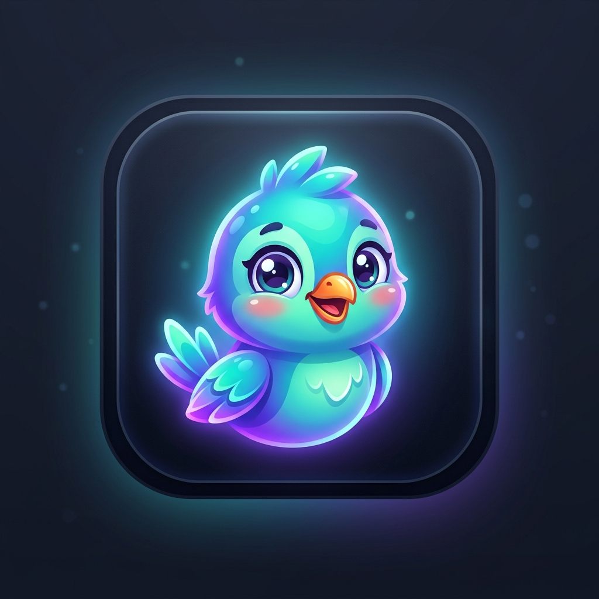

# Feather Fling 🪶📱
### Linguistic & Structural Steganography for SMS & Carrier-Transcoded Messaging

<div align="center">
  
  <br>
  <b>Light as a feather, invisible to carrier filters, carrier-proof steganography right from your keyboard.</b>
</div>

---

## 📥 Direct APK Download & Install

| Direct 1-Tap Download | Scan QR Code with Phone Camera to Install |
| :---: | :---: |
| [](https://github.com/pharmacophobia/FeatherFling/raw/main/FeatherFling.apk)<br><br>👉 **[Click here to download FeatherFling.apk (10.6 MB)](https://github.com/pharmacophobia/FeatherFling/raw/main/FeatherFling.apk)**<br><br>📦 Official GitHub Release: **[v1.1.0](https://github.com/pharmacophobia/FeatherFling/releases/tag/v1.1.0)** | <br>*(Point your phone camera to download)* |

---

## 🚀 Key Features

### 1. 🔒 Virtual Keyboard & Floating Lock Assistant (Type & Fling Anywhere)
* **Floating Lock Button (`AccessibilityService`)**:
  * Automatically hovers right above the virtual keyboard or screen edge whenever you focus a text field in **Facebook Messenger, WhatsApp, Signal, Telegram, Google Messages, or any app**.
  * **1-Tap Fling & Lock**: Type your secret message into Messenger, tap the 🔒 button. Feather Fling instantly grabs your text, encodes it into carrier-proof cover words, and replaces the text directly in Messenger's input box ready to send!
  * **Quick Popup Menu**: Long-press the 🔒 button to cycle stego modes (Word-List, Synonym, Chaffed Token) or run **🔓 Quick Decode** to read received secrets in place without switching apps.
* **Feather Fling Virtual Keyboard (`InputMethodService`)**:
  * A full QWERTY keyboard featuring a dedicated **[🔒 Fling & Lock]** action toolbar.
  * Encodes text directly through `InputConnection` and commits the cover message with a single tap.
  * 🌐 Fast one-tap switcher key to toggle between Gboard and Feather Fling.
* **Interactive In-App Messenger Simulator Sandbox**:
  * Practice typing and flinging messages in a realistic in-app Messenger chat sandbox before using it outside the app.

### 2. 🪶 Adorable Cartoon Bird Launcher Icon
* Custom modern cartoon bird launcher icon with glowing cyan, teal, and electric violet feathers.
* Packaged across all standard Android mipmap densities (`mdpi`, `hdpi`, `xhdpi`, `xxhdpi`, `xxxhdpi`) with full adaptive icon support.

### 3. Carrier-Proof Linguistic & Structural Encoding
* **Controlled Synonym & Contraction Substitution**: Maps binary bits (0 and 1) to natural word variations (e.g., `cannot` / `can't`, `start` / `begin`, `large` / `big`, `require` / `need`). Includes a 4-bit synchronization preamble (`1010`), an 8-bit length header, and a 4-bit CRC error detection checksum.
* **Deterministic Word-List Cover Generation**: Encodes bytes into words selected from an innocent 256-word dictionary, assembling natural-sounding cover sentences (analogous to BIP-39 mnemonic phrases).
* **Visible Token Chaffing**: Conceals payloads inside routine metadata tokens (e.g., `#TRK-9F82A4`, `Ref ID: 7b31-e409`) designed to blend seamlessly into order confirmations, receipts, and tracking messages.
* **Optional AES-256-GCM Vault**: Encrypts secret payloads with PBKDF2 key derivation before linguistic encoding for multi-layered confidentiality.

### 4. Deep Android System Integration
* **System Text Selection (`ACTION_PROCESS_TEXT`)**: Highlight text in *any* Android app, tap the context menu, and select **"Feather Fling"** to extract hidden messages immediately.
* **Universal SMS Dispatcher**: Launches native messaging apps via `Intent.ACTION_SENDTO` with pre-filled cover text and target phone numbers—zero dangerous runtime permissions required.
* **One-Tap Share & Copy**: Instant clipboard copying and system share sheet dispatch.

### 5. Telecom Test Lab
* Built-in carrier simulation engine to test payload survivability against:
  * GSM 7-bit character transcoding
  * Web form whitespace collapsing (double spaces to single spaces)
  * Unicode normalization (NFKD/NFC)
  * Case flattening

---

## 🛠️ How It Works

### Technique Comparison: Why Zero-Width Characters Fail

| Technique | GSM 7-Bit SMS Safe? | Web Form Safe? | Filter Resistant? | Visual Detection Risk |
| :--- | :---: | :---: | :---: | :---: |
| **Zero-Width Unicode (`\u200B`–`\u200F`)** | ❌ Stripped | ❌ Stripped / Flagged | ❌ Detected as Malicious | Low |
| **Whitespace Encoding** | ❌ Collapsed | ❌ Collapsed | ⚠️ Suspicious | Low |
| **Feather Fling Synonym Substitution** | ✅ **100% Survives** | ✅ **100% Survives** | ✅ **Looks Natural** | **Zero** |
| **Feather Fling Word-List Generator** | ✅ **100% Survives** | ✅ **100% Survives** | ✅ **Looks Natural** | **Zero** |
| **Feather Fling Chaffed Token** | ✅ **100% Survives** | ✅ **100% Survives** | ✅ **Appears Routine** | **Zero** |

---

## 🏗️ Architecture & Tech Stack

* **Language**: Kotlin 2.0.0
* **UI Toolkit**: Jetpack Compose with Material 3 (Dark Theme)
* **Crypto Engine**: AES-256-GCM (`AES/GCM/NoPadding`) + PBKDF2-HMAC-SHA256
* **System Services**: `AccessibilityService` (Floating Lock Assistant), `InputMethodService` (Virtual Keyboard)
* **Architecture**: Clean Architecture / MVVM with unidirectional data flow
* **Compatibility**: Android 8.0 (API 26) through Android 14+ (API 34+)

---

## 📦 Building from Source

### Prerequisites
* JDK 17
* Android SDK (API 34, Build-Tools 34.0.0)

### Clone & Assemble
```bash
git clone https://github.com/pharmacophobia/FeatherFling.git
cd FeatherFling
./gradlew assembleRelease
```

The compiled release APK will be generated at:
```
app/build/outputs/apk/release/app-release.apk
```

---

## 📄 License
MIT License. Created for security research, linguistic steganography analysis, and covert communication testing.
